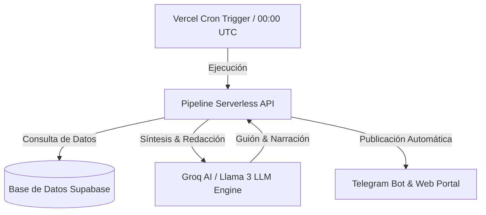

# 🌌 Almaniq Web

> **El motor inteligente de divulgación tecnológica y efemérides automatizadas impulsado por Inteligencia Artificial y Serverless Pipelines.**

[](LICENSE)
[](https://almaniq.atpdev.dev)
[](https://www.atpdev.dev)
[](#ia-engine)

**Almaniq Web** es la plataforma principal de la suite Almaniq. Combina pipelines serverless de análisis histórico con modelos de inteligencia artificial para investigar, generar y difundir diariamente contenido científico y tecnológico en múltiples formatos (Web, Bots de Telegram, Guiones de Video Short).

---

## 🌟 Características Principales

- 🤖 **Pipeline Automatizado con IA:** Tareas programadas en la nube que investigan, redactan y sintetizan efemérides destacadas de ciencia, astronomía y computación a las 00:00 UTC.
- 🎙️ **Generación de Guiones para Redes Sociales:** Conexión con Almaniq IA & Studio para producir guiones estructurados listos para locución y edición de video en formato corto (Shorts, TikTok, Reels).
- 📡 **Integración Multicanal:** Distribución instantánea a canales de Telegram, plataformas web y feeds RSS de tecnología.
- 📊 **Panel de Analítica Integrado:** Seguimiento de vistas, interacciones e impacto directo desde el portal de gestión ATP Dev.
- 🎨 **Interfaz Ultra-Moderna (SaaS Glassmorphism):** Experiencia de usuario pulida con componentes interactivos y transiciones fluidas.

---

## 🏗️ Arquitectura del Sistema



### Tecnologías Utilizadas

* **Core App:** Next.js, TypeScript, TailwindCSS / Vanilla CSS Glassmorphism.
* **Inteligencia Artificial:** Groq AI Cloud, Llama 3 70B, OpenAI API.
* **Infraestructura:** Supabase Storage & Database, Vercel Serverless & Cron Jobs.

---

## 🚀 Guía de Inicio Rápido

1. **Clonar el proyecto:**
   ```bash
   git clone https://github.com/Percy-30/almaniq-web.git
   cd almaniq-web
   ```

2. **Instalar dependencias:**
   ```bash
   npm install
   ```

3. **Configurar claves de entorno (`.env.local`):**
   ```env
   NEXT_PUBLIC_SUPABASE_URL=tu_supabase_url
   NEXT_PUBLIC_SUPABASE_ANON_KEY=tu_supabase_anon_key
   GROQ_API_KEY=tu_groq_api_key
   TELEGRAM_BOT_TOKEN=tu_telegram_bot_token
   ```

4. **Iniciar en modo desarrollo:**
   ```bash
   npm run dev
   ```

---

## 📄 Licencia y Créditos

Desarrollado con pasión por **[Percy AT / ATP Dev](https://www.atpdev.dev)**. Licencia MIT.
