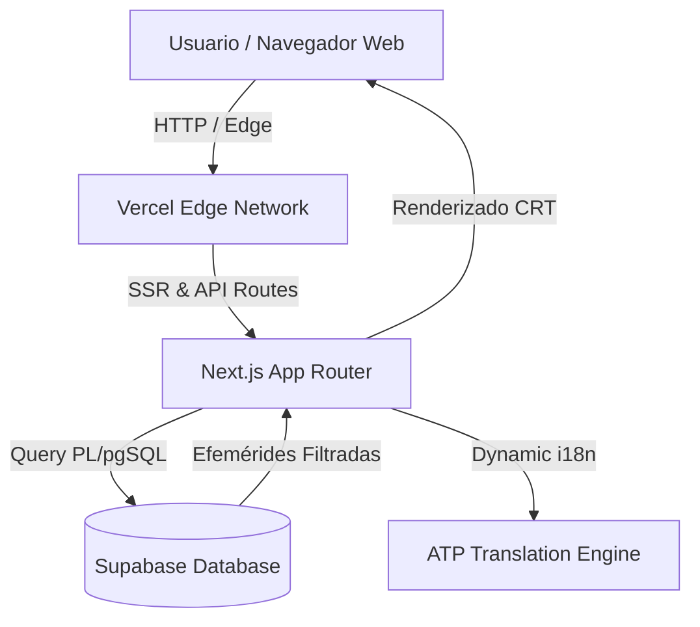

# 📜 Code History Day Web

> **El motor de efemérides diarias de informática y programación en tiempo real con estética Hacker Terminal CRT.**

[](LICENSE)
[](https://codehistory.atpdev.dev)
[](https://www.atpdev.dev)
[](#seguridad)

**Code History Day Web** es una plataforma interactiva diseñada para preservar y divulgar la memoria histórica del software libre, la computación y la tecnología. Inspirada en las consolas CLI de los años 80 y 90, ofrece una experiencia inmersiva con latencia cero para descubrir qué hitos informáticos ocurrieron día a día en la historia.

---

## 🚀 Características Principales

- 💻 **Terminal CLI Interactivo:** Emulación de consola CRT con comandos en tiempo real (`code-history --day`, `help`, `clear`).
- 📅 **Calendario de Efemérides Históricas:** Cobertura de lanzamientos de sistemas operativos (UNIX, Linux, MS-DOS), lenguajes de programación (C, Python, Java, Rust) y eventos clave en la historia del software.
- 🌐 **Soporte Multilingüe Global (i18n):** Traducción automática y contextual a 8 idiomas principales.
- ⚡ **Despliegue Serverless en el Edge:** Tiempos de carga menores a 50ms impulsados por Vercel Edge Network y Supabase PL/pgSQL.
- 📱 **Diseño Inmersivo Retro-Futurista:** CSS Glassmorphism + Efectos Scanline CRT responsive para móviles y escritorio.

---

## 🛠️ Arquitectura Técnica



### Stack Tecnológico

* **Frontend:** TypeScript, Next.js, Vanilla CSS Glassmorphism, CRT Scanlines Engine.
* **Backend:** Supabase PostgreSQL, PL/pgSQL, Vercel Serverless Functions.
* **Seguridad:** Encriptación SHA-256 de assets, cabeceras de seguridad CSP y HTTPS estricto.

---

## 📥 Instalación y Desarrollo Local

1. **Clonar el repositorio:**
   ```bash
   git clone https://github.com/Percy-30/code-history-day-web.git
   cd code-history-day-web
   ```

2. **Instalar dependencias:**
   ```bash
   npm install
   ```

3. **Configurar variables de entorno (`.env.local`):**
   ```env
   NEXT_PUBLIC_SUPABASE_URL=tu_supabase_url
   NEXT_PUBLIC_SUPABASE_ANON_KEY=tu_supabase_anon_key
   ```

4. **Ejecutar servidor de desarrollo:**
   ```bash
   npm run dev
   ```

---

## 🔒 Seguridad e Integridad

Todas las efemérides y código de la aplicación cuentan con firma criptográfica **SHA-256** para garantizar la autenticidad y prevenir la alteración de datos históricos.

---

## 📜 Licencia

Desarrollado con ❤️ por **[Percy AT / ATP Dev](https://www.atpdev.dev)**. Licencia MIT. Basado en el proyecto original de *Moviedox*.
